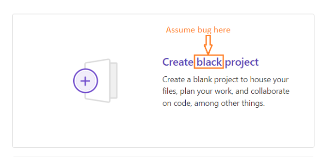

## Summary (Summarize the bug encountered concisely)

    While creating a new project using GitLab at the URL: https://gitlab.com/projects/new, I encountered a bug where the button label "Create Blank Project" appeares as "Create Black Project".

## Steps to reproduce     

   Go to URL: https://gitlab.com/projects/new. 
   Observe the top left box where the button label is displayed

## What is the current bug behavior?
     
    When attempting to create a new project, the button label displays "Create Black Project" instead of "Create Blank Project".

## What is the expected correct behavior?

    The button label should read "Create Blank Project" when creating a new project.
     
## Relevant logs and/or screenshots

## Possible fixes

    To resolve this issue, the text "Create Black Project" should be replaced with "Create Blank Project" in the code of the website.

## Whom do you report/ Assign To/ Tags

    /label ~bug ~reproduced ~UI 
    /cc @project-manager
    //assign @frontend-developer

## Priority

      Minor
